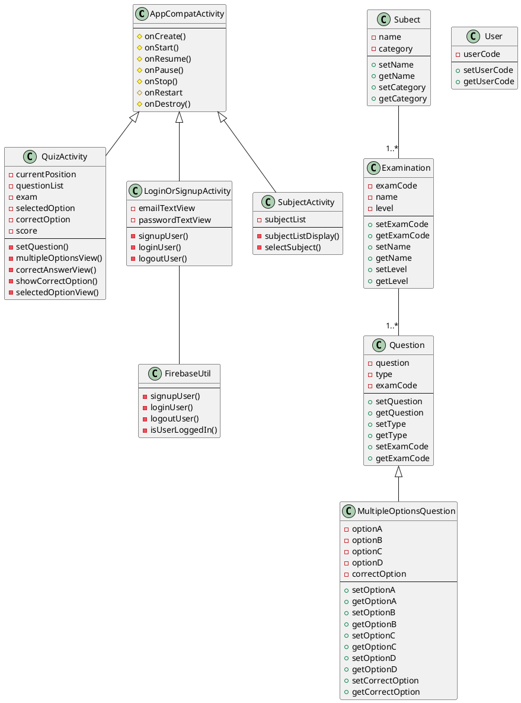

```plantuml
@startuml
class "AppCompatActivity" as compact {
  --
  # onCreate()
  # onStart()
  # onResume()
  # onPause()
  # onStop()
  # onRestart
  # onDestroy()
}

class "QuizActivity" as quiz {
  - currentPosition
  - questionList
  - exam
  - selectedOption
  - correctOption
  - score
  --
  - setQuestion()
  - multipleOptionsView()
  - correctAnswerView()
  - showCorrectOption()
  - selectedOptionView()
}

class "Question" as question {
  - question
  - type
  - examCode
  --
  + setQuestion
  + getQuestion
  + setType
  + getType
  + setExamCode
  + getExamCode
}

class "MultipleOptionsQuestion" as mOptions {
  - optionA
  - optionB
  - optionC
  - optionD
  - correctOption
  --
  + setOptionA
  + getOptionA
  + setOptionB
  + getOptionB
  + setOptionC
  + getOptionC
  + setOptionD
  + getOptionD
  + setCorrectOption
  + getCorrectOption
}

class "FirebaseUtil" as firebase {
  --
  - signupUser()
  - loginUser()
  - logoutUser()
  - isUserLoggedIn()
}

class "Subect" as subject {
  - name
  - category
  --
  + setName
  + getName
  + setCategory
  + getCategory
}

class "Examination" as exam {
  - examCode
  - name
  - level
  --
  + setExamCode
  + getExamCode
  + setName
  + getName
  + setLevel
  + getLevel
}

class "LoginOrSignupActivity" as authentication {
  - emailTextView
  - passwordTextView
  --
  - signupUser()
  - loginUser()
  - logoutUser()
}

class "SubjectActivity" as subjectActivity {
  - subjectList
  --
  - subjectListDisplay()
  - selectSubject()
}

class "User" as user {
  - userCode
  --
  + setUserCode
  + getUserCode
}

question <|-- mOptions
compact <|-- quiz
compact <|-- authentication
compact <|-- subjectActivity
authentication -- firebase
subject -- "1..*" exam
exam -- "1..*" question
@enduml

```