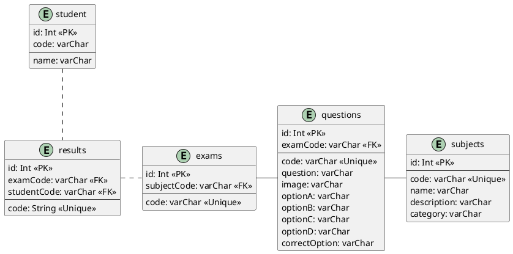

```plantuml
@startuml
entity subjects {
  id: Int <<PK>>
  --
  code: varChar <<Unique>>
  name: varChar 
  description: varChar 
  category: varChar 
}

entity questions {
  id: Int <<PK>>
  examCode: varChar <<FK>>
  --
  code: varChar <<Unique>>
  question: varChar
  image: varChar
  optionA: varChar
  optionB: varChar
  optionC: varChar
  optionD: varChar
  correctOption: varChar
}

entity exams {
  id: Int <<PK>>
  subjectCode: varChar <<FK>>
  --
  code: varChar <<Unique>>
}


entity results {
  id: Int <<PK>>
  examCode: varChar <<FK>>
  studentCode: varChar <<FK>>
  --
  code: String <<Unique>>
}

entity student {
  id: Int <<PK>>
  code: varChar
  --
  name: varChar
}

 
exams - questions
questions - subjects


results .up. student
results . exams
@enduml
```