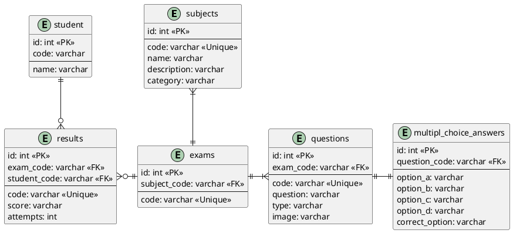

```plantuml
@startuml
entity subjects {
  id: int <<PK>>
  --
  code: varchar <<Unique>>
  name: varchar 
  description: varchar 
  category: varchar 
}

entity questions {
  id: int <<PK>>
  exam_code: varchar <<FK>>
  --
  code: varchar <<Unique>>
  question: varchar
  type: varchar
  image: varchar
}

entity "multipl_choice_answers" as answers{
  id: int <<PK>>
  question_code: varchar <<FK>>
  --
  option_a: varchar
  option_b: varchar
  option_c: varchar
  option_d: varchar
  correct_option: varchar
} 


entity exams {
  id: int <<PK>>
  subject_code: varchar <<FK>>
  --
  code: varchar <<Unique>>
}


entity results {
  id: int <<PK>>
  exam_code: varchar <<FK>>
  student_code: varchar <<FK>>
  --
  code: varchar <<Unique>>
  score: varchar
  attempts: int
}

entity student {
  id: int <<PK>>
  code: varchar
  --
  name: varchar
}

 
exams ||-up-|{ subjects
exams ||-right-|{ questions
questions ||-|| answers
results }o-up-|| student
results }o-|| exams

@enduml
```