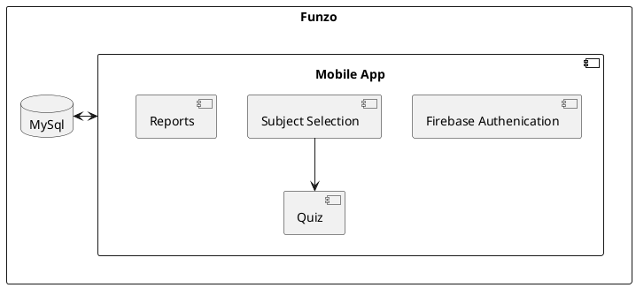

```plantuml
@startuml

rectangle "Funzo" {
  component "Mobile App" as app {
   [Firebase Authenication]
   [Subject Selection] as subject
   [Reports]
   [Quiz] as quiz
   subject -down-> quiz
  }
  database "MySql"  as db

}
app -> db
db -> app
@enduml

```