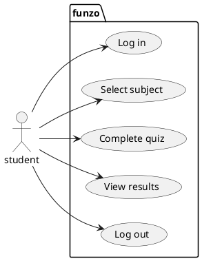

```plantuml
@startuml
actor student
package funzo {
  usecase "Log in" as logIn
  usecase "Select subject" as subject
  usecase "Complete quiz" as quiz
  usecase "View results" as results
  usecase "Log out" as logOut
}

left to right direction
student --> logIn
student --> subject
student --> quiz
student --> results
student --> logOut

@enduml
```